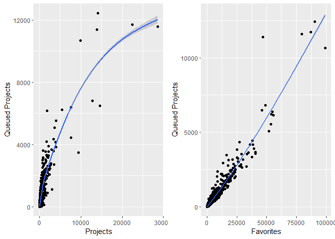

Ravelry Sweater Project, Part One
================
Jenna Conklin
2024-03-18

## What Factors Generate the Most Interest in a Ravelry Sweater Pattern?

To begin, let’s imagine our protagonist, Sadie. Sadie is an amateur
pattern designer who posts her patterns on Ravelry, a global platform
for the fiber arts community that allows users to discover new patterns,
sell or share their own patterns, post about their fiber arts projects,
and engage in discussion surrounding their work. As of this writing,
there are upwards of 1.3 million patterns available on Ravelry, some
free, some for purchase. Sadie already sells patterns for small
projects, such as hats and scarves, but she wants to expand her shop to
include larger works, starting with sweaters. Before investing her
effort into developing and marketing her first pattern, she hopes to
understand what factors will help her generate the most interest in her
work. In this project, I will retrieve a sample of highly-rated sweater
patterns using the Ravelry API, conduct both exploratory and inferential
analyses, and make recommendations for Sadie to take into account when
developing her first sweater pattern.

## Structure of the Project

To make it easier to navigate, this project is presented in three
sections.

1.  Chapter One: Retrieve, Clean, and Organize Data
2.  Chapter Two: Exploratory Data Analysis
3.  Chapter Three: Inferential Analysis and Conclusions

## Retrieve Data

In this project segment, I used ravelRy, a wrapper for the Ravelry API
developed by Kaylin Pavlik, as well as some tidyverse functions for data
cleaning and organization.

Before connecting to the API, I created a developer’s account by
visiting \[link\] <https://www.ravelry.com/pro/developer>. Once my
account was created, I created a new app with basic auth, read only
access. Then I set the credentials I had just created as system
variables labeled `RAVELRY_USERNAME` and `RAVELRY_PASSWORD`.

``` r
Sys.setenv(RAVELRY_USERNAME = "your-username", RAVELRY_PASSWORD = "your-password")
Sys.getenv("RAVELRY_USERNAME")
Sys.getenv("RAVELRY_PASSWORD")
```

Once I gained API access, I retrieved a sample of patterns using
ravelRy’s `get_patterns` function. Since `get_patterns` works best on
small queries of 100 - 500 lines, I used a loop to apply `get_patterns`
iteratively until my sample reached my desired size of 10,000 patterns.

Before using `get_patterns`, I used the `search_patterns` function to
identify the patterns I was interested in, then used `get_patterns` to
retrieve a larger set of data about each pattern of interest. For this
project, I limited my search to items in the category “sweater” that
appeared under a search query “sweater” and had a 5-star rating. My
sample included the most recent 10,000 patterns that matched these
criteria.

``` r
for (i in 1:100) {
  my_name <- paste('my_results', i, sep = "")
  assign(my_name, search_patterns(query = 'sweater', page = i, page_size = 100, rating = '5', category = 'sweater'))
  my_patterns <- paste('my_patterns', i, sep = "")
  my_id_df <- get(my_name)
  assign(my_patterns, get_patterns(ids = my_id_df$id))
  my_pattern_df <- get(paste('my_patterns', i, sep = ""))
  if (i == 1) {
    sweaters <- my_pattern_df
  }
  else {
    sweaters <- rbind(sweaters, my_pattern_df)
  }
}
```

And indeed, a dataframe containing 10,000 rows and 55 variables was
retrieved!

## Cleaning Data

To begin with, I discarded the columns I’m not interested in.

``` r
sweaters <- sweaters %>% select(-download_location, -currency_symbol, -url, -pdf_url, -currency, 
                        -gauge_divisor, -unlisted_product_ids, -pdf_in_library, 
                        -volumes_in_library, -gauge_description, -difficulty_count, 
                        -downloadable, -gauge_pattern, -has_uk_terminology, -has_us_terminology,
                        -permalink, -rating_count, -row_gauge, -yardage_max, 
                        -personal_attributes, -notes_html, -printings, 
                        -product_id, -ravelry_download, -created_at, -packs,  
                        -pattern_author, -photos, -pattern_type)
```

### Filter Out Non-Sweaters

Next, I wanted to confirm that all the patterns I retrieved are actually
patterns I am interested in. To do this, I dug into the data nested
under `pattern_categories` to determine which patterns included sweaters
and which did not. Some exploration revealed that
`pattern_categories$name` contained the information I am interested in,
so I inspected that column.

``` r
sweaters <- sweaters %>%
  hoist(pattern_categories, 
        category_subtype = "name") 

head(unique(sweaters$category_subtype))
```

    ## [[1]]
    ## [1] "Cardigan"
    ## 
    ## [[2]]
    ## [1] "Pullover"
    ## 
    ## [[3]]
    ## [1] "Pullover" "Scarf"   
    ## 
    ## [[4]]
    ## [1] "Hanging Ornament"
    ## 
    ## [[5]]
    ## [1] "Other"
    ## 
    ## [[6]]
    ## [1] "Cardigan" "Pullover"

As you can see, there are a number of entries that are clearly not
sweaters, such as “Hanging Ornament”, as well as some clothes for pets
and dolls. (For brevity, I am not including full output in this
summary.) To keep things relatively consistent throughout the sample, I
kept patterns labeled “Pullover”, “Cardigan”, or “Shrug/Bolero”. Many
patterns have more than one label, as patterns for multiple items are
included in a single listing (for instance, a matching sweater and
scarf).

``` r
sweater_names <- c("Pullover", "Cardigan", "Shrug / Bolero") 
sweaters <- subset(sweaters, sapply(category_subtype, \(x) any(sweater_names %in% x))) 
head(unique(sweaters$category_subtype))
```

    ## [[1]]
    ## [1] "Cardigan"
    ## 
    ## [[2]]
    ## [1] "Pullover"
    ## 
    ## [[3]]
    ## [1] "Pullover" "Scarf"   
    ## 
    ## [[4]]
    ## [1] "Cardigan" "Pullover"
    ## 
    ## [[5]]
    ## [1] "Pullover" "Tee"     
    ## 
    ## [[6]]
    ## [1] "Shrug / Bolero"

``` r
print(paste("The sample now contains", nrow(sweaters), "rows.", sep = " "))
```

    ## [1] "The sample now contains 9143 rows."

Inspecting the data reveals that all remaining patterns now include some
type of sweater, and the sample still contains 9143 patterns.
Furthermore, a quick inspection of `sweaters$parent.name` reveals that I
have eliminated all the pet sweaters and doll sweaters as well as the
non-sweater items (truncated here for brevity).

### Unnest and Clean Needle Size and Craft Type Data

Next, I organized the data on needle size and converted it into a usable
format. To start, I pulled the data on needle size and craft type out of
their nested lists.

``` r
sweaters <- sweaters %>%
  hoist(pattern_needle_sizes, 
        needle_size_knit = "metric", 
        needle_size_crochet = "hook")%>%
  hoist(craft, 
        craft_name = "name")

unique(sweaters$craft_name)
```

    ## [1] "Knitting"         "Crochet"          "Machine Knitting" "Loom Knitting"

The sample included not only patterns for hand-crafted items in both
knitting and crochet, but also patterns for machine knitting or
hand-knit items made with a knitting loom. Sadie is not well-versed in
these approaches, so I filtered them out. The sample still contained
plenty of data.

``` r
sweaters<- sweaters %>% 
  filter(craft_name == "Knitting" | craft_name == "Crochet")
print(paste("The sample now contains", nrow(sweaters), "rows.", sep = " "))
```

    ## [1] "The sample now contains 9108 rows."

To facilitate later analysis, I created a single column containing all
needle sizes offered for each pattern, selecting the correct data based
on the craft type for each pattern. Since many patterns listed multiple
needle sizes, I also computed the average needle size (for knit patterns
only, which use numeric sizes) and the number of needle sizes listed on
the pattern for future analysis.

``` r
#create a single column for needle size, pulling from needle_size_knit and needle_size_crochet

sweaters <- sweaters %>%
  mutate(needle_size = case_when(craft_name == "Knitting" ~ needle_size_knit, 
                                 craft_name == "Crochet" ~ needle_size_crochet)) %>%
  select(-needle_size_knit, -needle_size_crochet)

#clean up formatting in needle_size column
#convert to string 
sweaters <- sweaters %>%
  mutate(needle_size_char = as.character(needle_size))

#remove or standardize undesirable formatting
sweaters$needle_size_cleaned <- gsub('\\"', "", as.character(sweaters$needle_size_char))
sweaters$needle_size_cleaned <- gsub("^c\\(, ", "c\\(", as.character(sweaters$needle_size_cleaned))
sweaters$needle_size_cleaned <- gsub(" , ", "", as.character(sweaters$needle_size_cleaned))
sweaters$needle_size_cleaned <- gsub(",\\)", "\\)", as.character(sweaters$needle_size_cleaned))
sweaters$needle_size_cleaned <- gsub("^$", "None Given", as.character(sweaters$needle_size_cleaned))
sweaters$needle_size_cleaned <- gsub("NULL", "None Given", as.character(sweaters$needle_size_cleaned))
sweaters$needle_size_cleaned <- gsub("c\\(\\)", "None Given", as.character(sweaters$needle_size_cleaned))
sweaters$needle_size_cleaned <- gsub(", \\)", "\\)", as.character(sweaters$needle_size_cleaned))
sweaters$needle_size_cleaned <- gsub("/", ", ", as.character(sweaters$needle_size_cleaned))
sweaters$needle_size_cleaned <- gsub("c\\(", "", as.character(sweaters$needle_size_cleaned))
sweaters$needle_size_cleaned <- gsub("\\)", "", as.character(sweaters$needle_size_cleaned))
sweaters$needle_size_cleaned <- gsub(", ", ",", as.character(sweaters$needle_size_cleaned))

#split into lists based on comma, respecting type and create columns for needle size 
#count and average needle size
sweaters <- sweaters %>%
  mutate(needle_size_list = type.convert(strsplit(needle_size_cleaned, ","), as.is = T)) %>% 
  mutate(needle_size_count = lengths(needle_size_list), 
         average_needle_size = case_when(needle_size_cleaned == "None Given" |craft_name == "Crochet" ~ list("None Given"),
                                         craft_name == "Knitting" ~ lapply(needle_size_list, mean))) %>%
  select(-pattern_categories, -craft, -pattern_needle_sizes, -needle_size_list, -needle_size_char,
         -needle_size) %>%
  mutate(needle_size = needle_size_cleaned) %>%
  select(-needle_size_cleaned)

#inspect output
head(sweaters%>%select(needle_size, needle_size_count, average_needle_size), n = 15)
```

    ##       needle_size needle_size_count average_needle_size
    ## 1      None Given                 1          None Given
    ## 2        3.75,4.5                 2               4.125
    ## 3            3.75                 1                3.75
    ## 4             4,3                 2                 3.5
    ## 5           D,G,G                 3          None Given
    ## 6          3.25,4                 2               3.625
    ## 7          3.25,4                 2               3.625
    ## 8          3.25,4                 2               3.625
    ## 9               5                 1                   5
    ## 10     None Given                 1          None Given
    ## 11     None Given                 1          None Given
    ## 12              J                 1          None Given
    ## 13 4.5,3.5,3.25,6                 4              4.3125
    ## 14            4.5                 1                 4.5
    ## 15       3.75,4.5                 2               4.125

Now the dataset contains useful columns giving the average needle size
and needle size count.

### Unnest and Clean Yarn Weight Data

Let’s inspect the values given for yarn weight.

``` r
table(sweaters$yarn_weight_description)
```

    ## 
    ##                                    Any gauge - designed for any gauge 
    ##                                206                                 57 
    ##                       Aran (8 wpi)                     Aran / Worsted 
    ##                               1416                                 11 
    ##                      Bulky (7 wpi)                             Cobweb 
    ##                                914                                  5 
    ##                        DK (11 wpi)                         DK / Sport 
    ##                               2553                                  7 
    ##                 Fingering (14 wpi)                    Jumbo (0-4 wpi) 
    ##                                973                                 20 
    ##                               Lace                    Light Fingering 
    ##                                159                                194 
    ##                     Sport (12 wpi)              Super Bulky (5-6 wpi) 
    ##                                815                                388 
    ##                             Thread                    Worsted (9 wpi) 
    ##                                 11                               1379

Some of these categories can be collapsed, as they are either
functionally the same or similar enough for our purposes.

``` r
#clean up entries
sweaters$yarn_weight <- gsub(" \\(.*", "", as.character(sweaters$yarn_weight_description))
sweaters$yarn_weight <- gsub("^Aran$", "Aran / Worsted", sweaters$yarn_weight)
sweaters$yarn_weight <- gsub("^Worsted$", "Aran / Worsted", sweaters$yarn_weight)
sweaters$yarn_weight <- gsub("^DK$", "DK / Sport", sweaters$yarn_weight)
sweaters$yarn_weight <- gsub("^DK$", "DK / Sport", sweaters$yarn_weight)
sweaters$yarn_weight <- gsub(" - .*", "", sweaters$yarn_weight)
sweaters$yarn_weight <- sub("Light ", "", sweaters$yarn_weight)
sweaters$yarn_weight <- sub("^$", "None Given", sweaters$yarn_weight)
sweaters$yarn_weight <- sub("Cobweb", "Lace", sweaters$yarn_weight)
sweaters$yarn_weight <- sub("Thread", "Lace", sweaters$yarn_weight)
sweaters$yarn_weight <- sub("^Bulky$", "(Super) Bulky / Jumbo", sweaters$yarn_weight)
sweaters$yarn_weight <- sub("^Super Bulky$", "(Super) Bulky / Jumbo", sweaters$yarn_weight)
sweaters$yarn_weight <- sub("^Jumbo$", "(Super) Bulky / Jumbo", sweaters$yarn_weight)

#set levels of variable
sweaters$yarn_weight <- factor(sweaters$yarn_weight, levels = c(
  "Any gauge", 
  "(Super) Bulky / Jumbo",
  "Aran / Worsted", 
  "DK / Sport",      
  "Fingering",                                
  "Lace",
  "None Given" 
  ))

#inspect column
table(sweaters$yarn_weight)
```

    ## 
    ##             Any gauge (Super) Bulky / Jumbo        Aran / Worsted 
    ##                    57                  1322                  2806 
    ##            DK / Sport             Fingering                  Lace 
    ##                  2560                  1167                   175 
    ##            None Given 
    ##                   206

``` r
#remove unneeded column
sweaters <- sweaters%>%select(-yarn_weight_description)
```

Now the dataset boasts a much more functional set of yarn weight
descriptions.

### Unnest and Clean Languages Data

Next I brought the languages data out of its nested format and created a
column for the number of languages listed for each pattern.

``` r
sweaters <- sweaters %>%
  hoist(languages, 
        language = "name") %>%
  mutate(language_count = lengths(language)) %>%
  select(-languages)


head(sweaters%>%select(language, language_count), n = 20)
```

    ##                                               language language_count
    ## 1                                              English              1
    ## 2                                              English              1
    ## 3                                              English              1
    ## 4                                              English              1
    ## 5                                      English, German              2
    ## 6                                              English              1
    ## 7                                              English              1
    ## 8                                              English              1
    ## 9                                              English              1
    ## 10                                             English              1
    ## 11                                             English              1
    ## 12                                             English              1
    ## 13                                             English              1
    ## 14                                              Polish              1
    ## 15                                             English              1
    ## 16                                             English              1
    ## 17 Danish, English, French, German, Norwegian, Swedish              6
    ## 18                                             English              1
    ## 19                     Danish, English, German, Polish              4
    ## 20                            English, French, Spanish              3

### Calculate Length of Notes

In case the length of the written description included in the “Notes”
field impacts the amount of interest the pattern generates, I computed
the number of characters in that field, then removed the `notes` column
itself.

``` r
sweaters <- sweaters %>%
  mutate(notes_length = nchar(notes)) %>%
  select(-notes)

summary(sweaters$notes_length)
```

    ##    Min. 1st Qu.  Median    Mean 3rd Qu.    Max. 
    ##       0     414     985    1317    1860   11279

As can be seen, pattern notes come in quite a range of sizes!

### Create Variables for Pattern Attributes of Interest

Finally, I unnested and coded a few additional characteristics of the
patterns that we are interested in exploring. There are many attributes
we could focus on. For this analysis, I’ll consider whether offering
plus-sized or petite sizing has any impact on a pattern’s success, as
well as whether being tagged as worked in the round or flat has an
impact. (In the round knitting refers to a circular style of work,
spiraling around the piece as it is created, while pieces worked flat
are knit in a back-and-forth manner and connected along a seam if the
final product is round.)

``` r
#hoist attributes data out of nested column
sweaters <- sweaters %>%
  hoist(pattern_attributes, 
        attributes = "permalink")

#create columns for plus and petite attributes and combine into one column
sweaters <- sweaters %>%
  mutate(plus = ifelse(str_detect(as.character(attributes), "plus"), T, F),
         petite = ifelse(str_detect(as.character(attributes), "petite"), T, F)) %>%
  mutate(plus_petite = case_when(plus == "TRUE" & petite == "FALSE" ~ "Plus", 
                                 plus == "FALSE" & petite == "TRUE" ~ "Petite", 
                                 plus == "FALSE" & petite == "FALSE" ~ "Neither", 
                                 plus == "TRUE" & petite == "TRUE" ~ "Both"))

#create columns for round and flat work and combine into one column
sweaters <- sweaters %>%
  mutate(in_the_round = ifelse(str_detect(as.character(attributes), "in-the-round"), T, F), 
         worked_flat = ifelse(str_detect(as.character(attributes), "worked-flat"), T, F)) %>%
  mutate(workstyle = case_when(in_the_round == "TRUE" & worked_flat == "FALSE" ~ "In the Round", 
                               in_the_round == "FALSE" & worked_flat == "TRUE" ~ "Worked Flat", 
                               in_the_round == "FALSE" & worked_flat == "FALSE" ~ "Neither", 
                               in_the_round == "TRUE" & worked_flat == "TRUE" ~ "Both"))
#display results
unique(sweaters$plus_petite)
```

    ## [1] "Neither" "Plus"    "Both"    "Petite"

``` r
unique(sweaters$workstyle)
```

    ## [1] "Worked Flat"  "Neither"      "Both"         "In the Round"

``` r
#clean up columns no longer needed
sweaters <- sweaters %>% select(-pattern_attributes, -attributes, -in_the_round, -worked_flat, -plus, -petite)
```

### Compare Variables Capturing Interest in Pattern

Since sales data is not publicly available, I’ll need some kind of proxy
measure for interest to help Sadie predict what might help direct the
most traffic to her patterns. A few promising measures include the
number of comments on a pattern, the number of completed projects logged
on Ravelry, the number of times users have favorited the pattern, or the
number of times users have added the pattern to their queue of future
planned projects. Before selecting one of these three to focus on, I
examined their relative distribution through a quick scatter plot.

    ## `geom_smooth()` using method = 'gam' and formula = 'y ~ s(x, bs = "cs")'
    ## `geom_smooth()` using method = 'gam' and formula = 'y ~ s(x, bs = "cs")'

<!-- -->

    ## [1] "The number of patterns with zero completed projects is 1065."

    ## [1] "The number of patterns with zero queued projects is 577."

    ## [1] "The number of patterns with zero favorited projects is 22."

As can be seen, all three are left-skewed with a few high outliers.
There is a possible parabolic relationship between Projects and Queued
Projects, and a possible linear relationship between Favorites and
Queued Projects. Furthermore, the count of completed projects has a
large number of zeroes, while the favorites count has very few zeroes.
Taking all this into account, it seems likely that the completed
projects count will radically underpredict interest in a pattern, since
not everyone who buys a pattern will complete a project and upload it to
Ravelry. Furthermore, favorites likely overpredicts interest in actually
buying a pattern, since marking a pattern as a favorite signals
interest, but not necessarily intent to pursue a project, while queuing
a project likely signals a stronger degree of interest. Therefore, I
will use Queued Projects Count as a proxy for potential sales in
completing this analysis.

### Save Cleaned Dataframe

At last, it’s time to save our work and proceed to the next stage of
analysis!

``` r
write.csv(sweaters, 'cleaned_data.csv', row.names = F)
```
