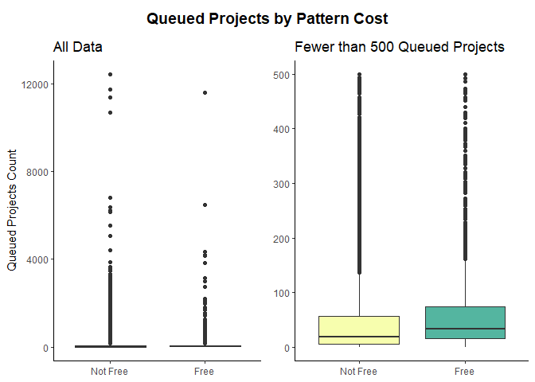

Sadie’s Sweaters, Part Two
================
Jenna Conklin
2024-03-18

## Exploratory Data Analysis

This is part two of the Sadie’s Sweaters project, which presents an
exploratory data analysis of 9108 sweater patterns retrieved from
Ravelry,com, a global platform for the fiber arts community. To learn
more about how the data was sourced and cleaned, see part one of the
project. In this project segment, I explore the relationship between the
number of times a Ravelry user added a project to their queue of future
projects to complete (a proxy measure for interest in the pattern) and a
number of other factors, including length of description, yarn weight,
yardage of yarn required, average needle size, cost of pattern, number
of languages pattern is available in, and more, and formulate some
initial recommendations for our protaganist, Sadie, a pattern designer
who is hoping to expand her offerings on Ravelry to include sweaters.

## Length of Description

Is it important to have a pattern description of particular length to
maximize interest in your patterns? The scatterplot below compares
length of the notes field (in number of characters) and queued project
count, a proxy for interest in a pattern. It seems evident that there is
no strong relationship between the length of description and the amount
of interest generated by a pattern. Very popular patterns had
descriptions of many lengths, and no particular length appears to
correspond to more or less interest.

<!-- -->

## Properties of Yarn

An important aspect of planning a fiber arts project involves selecting
and sourcing an appropriate yarn for the item to be created. Thus, it is
easy to imagine that what type and amount of yarn a pattern is written
for will be an important deciding factor for Ravelry users selecting a
pattern. Below, I examined the distribution of yarn weights across
patterns in the sample, taking into account whether the pattern was
written for crochet or knitting. As can be seen, a sizable minority of
patterns did not specify a yarn weight; of those that did specify a
weight, an approximately normal distribution was present from the
thinnest yarn weight (lace) to the thickest (super bulky / jumbo). The
majority of patterns used DK, sport, aran, or worsted weight yarns, the
mid range of weights available.

<!-- -->

While we now know the most common yarns present in the sample, how did
the yarn weight given affect interest in the pattern? As we can see
below, no notable trend emerges for yarn weight, except perhaps that
patterns designed for any yarn weight sometimes generate slightly more
interest than any specific weight, as evaluated through their queued
project count. (For ease of visualization, upper outliers with regard to
queued projects are omitted from graphics throughout this analysis.)

<!-- -->

In addition to the type of yarn required, perhaps the amount of yarn
needed for a project influences how interested users are in a pattern.
Before investigating this directly, I checked whether there was an
obvious relationship between the type and amount of yarn needed.

<!-- -->

Yardage appears to decrease slightly as yarn weight increases, which is
sensible as less yardage of a thicker yarn is needed to make a fabric of
similar size. But is there a relationship between the amount of interest
generated by a pattern and the amount of yarn needed for it? Upon visual
inspection of the scatterplot below, yardage does not appear to be a
good predictor of interest in a pattern.

<!-- -->

As a final inquiry related to yarn type, perhaps the number of specific
yarns recommended for use in the pattern has an impact on interest. In
the boxplots below, we see that the data is heavily right-skewed, making
it difficult to assess differences between groups. In the second panel,
I have eliminated outliers above 500 queued projects to allow for a
closer visual inspection; however, even with this adjustment, the
distributions appear to be fairly similar. If there is a relationship
here, it is not visible to the naked eye.

<!-- -->

## Needle Size

Closely related to yarn weight is the needle size used to create a
project. Generally speaking, smaller needles are used for thinner yarns
and vice versa, although the correspondence is not exact and different
yarn and needle sizes may be mixed to create a range of effects. In this
section, I will only examine knitting patterns, as knitting needle sizes
are given in a different scale than crochet hook sizes and the vast
majority of patterns in the sample are knitting patterns.

To begin, I wanted to better understand the distribution of needle sizes
in the sample. The correlation between needle size and yarn weight is
illustrated in the heatmap below, which visualizes the number of
patterns that use each yarn weight and needle size. As can be seen, most
patterns use needle sizes 3 - 6 with DK, sport, aran, or worsted yarns,
and the thicker aran and worsted yarns tend to appear with the slightly
larger (size 5 - 6) needles, while the slightly finer DK and sport yarns
tend to appear with a smaller recommended needle size of 3 to 4.
However, some variation is present, especially in the super bulky/jumbo
yarn weight column.

<!-- -->

The distribution of needle sizes throughout the sample is roughly
normal, with the majority of patterns recommending a needle in the size
3 - 6 range. Furthermore, most patterns are written for one or two
recommended needle sizes, though a minority recommend three or more
needle sizes.

<!-- -->

Now that we know how needle size is distributed through the sample, it
is time to examine whether it is relates to interest in a pattern in any
way. To do this, let us consider how average needle size and number of
recommended needle sizes relate to how often users add a pattern to
their project queue. (Each of these graphs is trimmed to remove outliers
not visible in the ridge plot.)

<!-- -->

As we can see, interest in a pattern is generally similar across needle
sizes and numbers of recommended needle sizes, but some patterns with
larger needles manage to generate greater than average interest (the
bumps on the average needle size \> 8 row), as do a few of the patterns
that give four and five needle sizes to choose from.

## Round and Flat Patterns

Another key difference in knitting patterns comes in the design of the
pattern itself. Sweaters require a number of elements that are roughly
cylindrical (think of the sleeves and trunk of a sweater), and thus have
the option to be worked “in the round”, meaning the the knitting
proceeds in a spiral fashion rather than a flat, back-and-forth style.
Items worked flat will require seams to create a cylindrical shape,
while items worked in the round require a special type of needle, known
as circular needles. Beginners typically learn to knit flat first, and
then learn to knit in the round as their skills increase, although there
is an argument to be made for knitting in the round being simpler
overall. All this being said, will patterns written in the round versus
those meant to be worked flat generate notably different interest among
Ravelry users?

<!-- -->

As for previous inquiries, the right-skewed nature of the data makes it
difficult to spot differences in the left panel. The right panel, which
excludes outliers above 500, is clearer. Patterns worked in the round
may generate slightly more interest than those worked flat, but a great
many patterns in the sample fall outside these two categories, being
tagged either with both or neither. Patterns tagged with both “in the
round” and “worked flat” may be patterns that include multiple elements,
such as a matching hat and scarf, or those for which a part of the
pattern is worked flat and a part is worked in the round, such as the
sleeves and body of a sweater. Those tagged “neither” must in fact be
worked in one fashion or the other, but the pattern designer did not
utilize the pattern attribute tags for flat or round work when uploading
their pattern.

Based on this exploration, I will recommend that Sadie consider
designing patterns worked in the round over those worked flat.

## Petite and Plus-Sized Patterns

Does offering plus or petite sizing increase interest in a pattern? Once
again, it is difficult to draw any insights from the full dataset (left
panel), but a closer look (right panel) suggests that patterns offering
either or both extra sizing options likely generate slightly more
interest than those with neither, although the difference is small.

<!-- -->

### Free versus Paid Patterns

How does offering a pattern for free affect interest in a pattern? As
can be seen, a few upper outliers suggest that paid patterns generate
more interest, while the position of means and third quartiles suggest
that free patterns generate more interest. Both differences are so
slight, however, that I would recommend Sadie consider the economic
necessities of her Ravelry store in deciding whether to offer patterns
for free rather than just considering the data from this sample.

<!-- -->

## Languages

Does the number of languages a pattern is available in affect interest
in a pattern? An initial inspection of the data suggests that it does
not, given the low queued project counts observed among patterns offered
in many languages and the lack of an obvious trend in the data.

<!-- -->

## Conclusion

Based on my findings in this exploratory analysis, my initial
recommendation is that Sadie consider designing knit patterns in the
round, offering patterns for free to generate more traffic to her shop,
offering extra sizing (such as plus or petite size options), and
including instructions for a range of needle sizes, ideally 4 - 5 sizes.
I would not recommend that she select yarn weight, needle size, language
options, or yardage of yarn required based on their potential to
generate more interest in the pattern on Ravelry, as none of these
factors appear to correlate to increased interest in the sample analyzed
here. Furthermore, Sadie should not elevate any of the factors I have
flagged as important above her own design considerations as an artist,
as each of the relationships I have described appears to be either
fairly weak or predict only a slight increase in interest.
